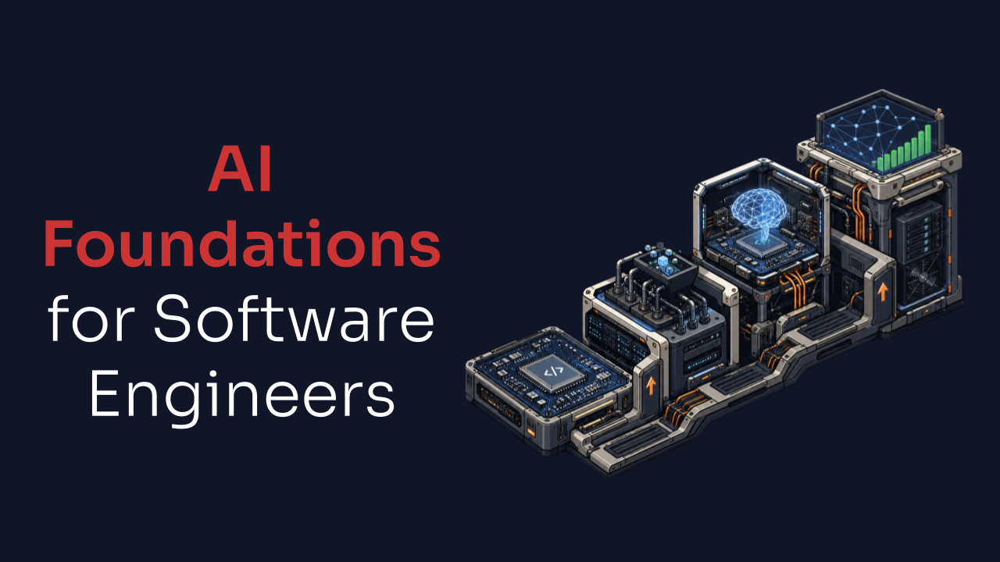

# AI Foundations for Software Engineers

**AI needs more software engineers.**

Recent advancements in modern AI have made it one of the most life-changing technologies of our time, but it can only be effective if applied successfully. This repo contains the resources software engineers need to build a foundational understanding of AI.

It's split into five sections intended to be worked in order:

1. [General Resources](#general-resources)
2. [ML Foundations](#ml-foundations)
3. [LLMs](#llms)
4. [Engineering](#engineering)
5. [Hands-on Guides](#hands-on-guides)

The guide follows these principles:

* **A solid foundation is most important.** Technologies used to build systems change over time, but their foundations don't. Building a solid foundation makes learning everything else easier.
* **Simplicity is king.** This learning roadmap is intentionally lean, while its technical resources go deep into topics. It's purpose-built to help busy professionals build intuition for how AI systems function without wasting time.
* **You don't understand what you can't build.** Many resources contain hands-on guides. Getting into the code is the best (and most fun) way to understand a topic and the only way to gain practical engineering experience.

This guide assumes the reader has prior experience with programming. Feel free to skip around between resources if you have a background in some topics but not others. Don't treat this as a definitive list of AI resources—there are many excellent AI learning resources. I share great resources as I find them on [X](https://x.com/loganthorneloe).

The best way to support this guide is by starring it and supporting the authors of the resources. If you're interested in more guides like this, subscribe to the [**AI for Software Engineers**](https://aiforswes.com/subscribe) newsletter. Feedback is appreciated.

Enjoy! 🚀

## General Resources

General resources for software design and technical judgment that help when engineering AI systems. Consider this *optional*.

- **[The Art of Doing Science and Engineering: Learning to Learn](https://press.stripe.com/the-art-of-doing-science-and-engineering)** by Richard W. Hamming  
  Two of the most important things to understand as an engineer working in AI are that AI is fundamentally a research discipline and that continued learning matters as much in AI as it does in software engineering. This book helps readers understand both. There is also a [shorter essay version](https://www.cs.utexas.edu/~dahlin/bookshelf/hamming.html) of this you can read if you prefer.

## ML Foundations

Resources for understanding the foundations of machine learning from the bottom up.

- **[Hands-On Machine Learning with Scikit-Learn and PyTorch](https://www.oreilly.com/library/view/hands-on-machine-learning/9798341607972/)** by Aurélien Géron  
  This book is the gold standard for getting hands-on with machine learning. You'll build a machine learning project end-to-end and get hands-on experience with the most important technologies and techniques in AI. It goes into great depth and covers many important topics in a single resource. The [accompanying repo](https://github.com/ageron/handson-mlp) includes notebooks and exercise solutions.

- **[Mathematics of Machine Learning](https://www.packtpub.com/en-us/product/mathematics-of-machine-learning-9781837027873)** by Tivadar Danka  
  This book teaches the linear algebra, probability, calculus, and optimization foundations that make models easier to reason about. This is another great resource that covers everything you need to know about ML math in a single book. Most engineers skip this part, but as AI advances, an understanding of the math behind it becomes more important. The book has an [accompanying repo](https://github.com/cosmic-cortex/mathematics-of-machine-learning-book).

## LLMs

Resources for understanding large language models, the most important topic in modern AI.

- **[The Illustrated Transformer](https://jalammar.github.io/illustrated-transformer/)** by Jay Alammar, with **[Transformer Series](https://www.3blue1brown.com/topics/neural-networks)** by 3Blue1Brown as the deeper visual companion  
  The transformer architecture is the most important concept to grasp when learning how LLMs work. Both resources teach it visually.

- **[Build a Large Language Model (From Scratch)](https://www.manning.com/books/build-a-large-language-model-from-scratch)** by Sebastian Raschka  
  This book walks through tokenization, embeddings, attention, transformer blocks, training, and fine-tuning so the pieces of an LLM become concrete. It takes you from zero to training your own LLM. The [accompanying repo](https://github.com/rasbt/LLMs-from-scratch) contains the code and exercises.

- **[Build a Reasoning Model (From Scratch)](https://www.manning.com/books/build-a-reasoning-model-from-scratch)** by Sebastian Raschka  
  Reasoning models have become fundamental to real-world AI applications. This book builds intuition for reasoning models by walking through the pieces needed to create one yourself and showing how the surrounding data, training process, and evaluation loop shape the behavior you see. This resource has an [accompanying repo](https://github.com/rasbt/reasoning-from-scratch).

- **[The RLHF Book](https://www.manning.com/books/reinforcement-learning-from-human-feedback)** by Nathan Lambert  
  Post-training is what turns a base language model into something that follows instructions and matches user expectations. Reinforcement learning is one important part of post-training. This book teaches preference data, reward modeling, reinforcement learning, and the tradeoffs behind shaping LLM behavior after pretraining. It has an [accompanying repo](https://github.com/natolambert/rlhf-book) and [lecture series](https://rlhfbook.com/course).

## Engineering

Resources for understanding the ML engineering, AI engineering, infrastructure, and operations work required to bring machine learning into real-world applications.

- **[Designing Machine Learning Systems](https://www.oreilly.com/library/view/designing-machine-learning/9781098107956/)** by Chip Huyen  
  Production ML is different from traditional software because system behavior depends on data distributions that can shift after launch. This book teaches the full production loop around data, model development, deployment, monitoring, and iteration. Its [accompanying repo](https://github.com/chiphuyen/dmls-book) contains chapter summaries and additional resources.

- **[AI Engineering](https://www.oreilly.com/library/view/ai-engineering/9781098166298/)** by Chip Huyen  
  Building applications with foundation models introduces additional nondeterminism and complexity. This book teaches the application-layer concepts—context, evals, agents, retrieval, and more—required to build reliable AI applications. Its [accompanying repo](https://github.com/chiphuyen/aie-book) includes chapter summaries, examples, and case studies.

- **[Designing Data-Intensive Applications](https://www.oreilly.com/library/view/designing-data-intensive-applications/9781491903063/)** by Martin Kleppmann  
  AI systems are data-intensive systems and require strong engineering to solve difficult data-system problems. This book is the gold standard for understanding these challenges and teaches storage, indexing, streams, replication, consistency, and distributed system tradeoffs. This book isn't AI-focused but teaches many required engineering concepts for building AI systems at scale.

- **[Building Effective Agents](https://www.anthropic.com/engineering/building-effective-agents)** by Anthropic  
  Agent engineering is in high demand and an excellent way to apply LLMs in a way that's actually helpful. This short read teaches when a workflow is enough, when an agent is actually useful, and the practical patterns for tool use and orchestration. Anthropic provides [companion implementation notebooks](https://github.com/anthropics/claude-cookbooks/tree/main/patterns/agents).

- **[Inference Engineering](https://www.baseten.co/inference-engineering/)** by Philip Kiely  
  Serving machine learning models at scale is an incredible engineering feat. It requires an understanding of model architecture, serving technologies, and serving hardware to optimize serving systems for latency, reliability, and cost. This is one of the strongest current opportunities for software engineers in AI, and this book does the best job of laying out the information and making it easily understandable.

- **[How to Scale Your Model](https://jax-ml.github.io/scaling-book/)** by Google DeepMind  
  Training large models is another incredible engineering feat and is as much a systems problem as a modeling problem. This online book builds intuition around accelerator parallelism, memory limits, communication costs, and the engineering tradeoffs behind scaling training efficiently. The [source repo](https://github.com/jax-ml/scaling-book) is available on GitHub.

## Hands-on Guides

Hands-on projects and guides for building, running, and studying working AI systems, including guides from the [AI for Software Engineers](https://aiforswes.com) newsletter.

- **[microgpt](https://karpathy.github.io/2026/02/12/microgpt/)** by Andrej Karpathy · *February 12, 2026* 
  Study and run the complete GPT training and inference algorithm in 200 lines of dependency-free Python, including tokenization, autograd, attention, and Adam optimization.

- **[Run a Local Coding Model](https://www.aiforswes.com/p/you-dont-need-to-spend-100mo-on-claude)** by Logan Thorneloe · *December 20, 2025* 
  Running a model locally is a good way to make open-model tradeoffs concrete. This guide teaches how to set up a local coding model, what the experience feels like compared to hosted coding assistants, and where local inference is useful.

- **[Build a Simple Recommendation System](https://www.aiforswes.com/p/collaborative-filtering)** by Logan Thorneloe · *November 11, 2025* 
  Recommendation systems are a small but useful way to see ML ideas in code. This guide teaches collaborative filtering, user and item embeddings, training with implicit feedback, serving recommendations, and retraining from simulated interactions.

- **[nanochat](https://github.com/karpathy/nanochat)** by Andrej Karpathy · *October 13, 2025* 
  Train a complete ChatGPT-style model through tokenization, pretraining, supervised fine-tuning, reinforcement learning, evaluation, and inference.

- **[mini-swe-agent](https://github.com/SWE-agent/mini-swe-agent)** · *June 28, 2025* 
  Run, inspect, and extend a compact software engineering agent that uses shell commands to work in repositories and resolve issues.

- **[Made With ML](https://madewithml.com/)** by Goku Mohandas · *2023* 
  Build a production-grade ML application from design and development through deployment, testing, monitoring, orchestration, and CI/CD.

- **[micrograd](https://github.com/karpathy/micrograd)** by Andrej Karpathy · *April 13, 2020* 
  Study a tiny automatic differentiation engine and train a small neural network from first principles to understand backpropagation at the code level.

---

**Support this guide by supporting the authors of these resources.**
